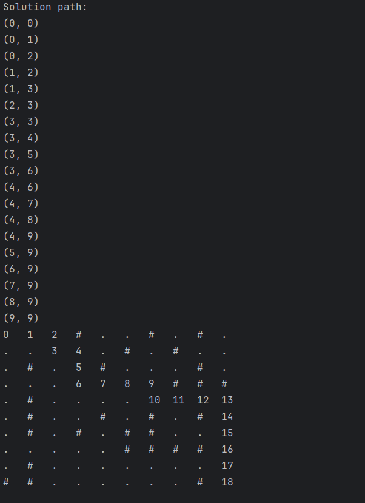

# Details zu dem Programm

## Beispiel für den Output

## Hilfe

Anbei eine kurze Erklärung

Ein Labyrinth hat immer einen Start- und Endpunkt.

Für zusätzliche Hilfe besuchen Sie folgende [Webseite](https://de.wikipedia.org/wiki/Labyrinth).

